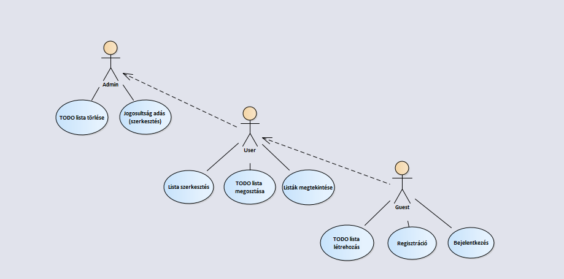
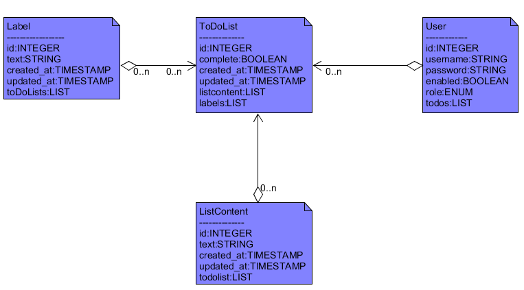
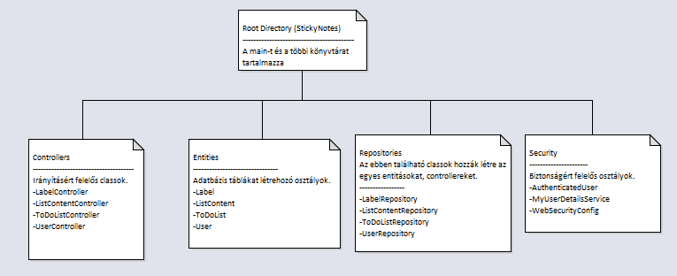
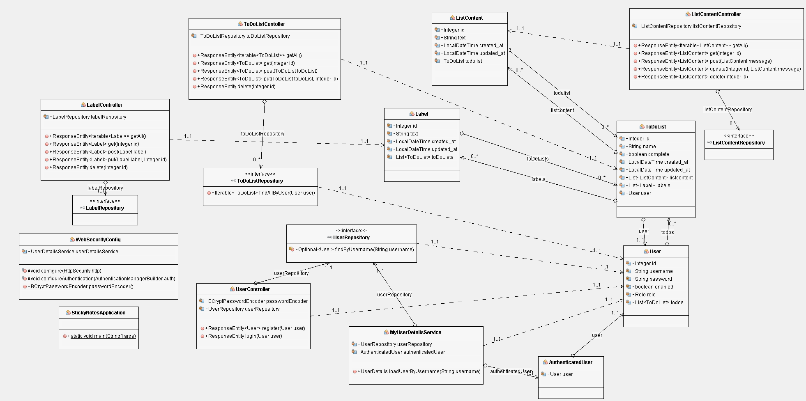

# Alkalmazások fejlesztése - Beadandó
## Dokumentáció
### Pleszkán Tamás, Hajdú Márk, Salgó Krisztián

## 0. Bevezető
A program egy egyszerű családi TODO alkalmazás lesz, ahol létre lehet hozni különböző TODO listákat amit a családtagok megtekinthetnek és szerkeszthetnek

## 1. Követelményanalízis
### Funkcionális követelmények

- Fiók létrehozása (regisztráció)
- Bejelentkezés
- TODO lista létrehozása
- Bejelentkezett felhasználók
    - Családtagok listáinak megtekintése
    - TODO lista megosztása a családtagokkal
    - Listák szerkesztése (Ha van joga hozzá)
- Családi admin jogok
    - Szerkesztésre jogosultság adás
    - TODO listák törlése (Done állapot beállítása)

### Nem funkciunális követelmények

- Átlátható felhasználói felület
- Jelszóval védett adatok

### Használatieset-modell

**Szerepek**
- Guest
- Bejelentkezett felhasználó
    - Családtag
    - Családfő (Admin)

**Folyamatok**

1. Bejelentkezik a felhasználó
2. Megtekintheti az eddig létrehozott TODO listáit
3. Az aktuális megnyitott listát szerkesztheti, amennyiben ő hozta létre vagy a Családfőtől kapott rá jogot
4. A listában a változtatásokat elmentheti vagy visszavonhatja
5. A TODO lista egyes pontjait elvégezettnek jelölheti

## 2. Tervezés

### Oldaltérkép

- Bejelentkezési oldal/Regisztrációs oldal
- Főoldal
    - Családok megjelenítése/menedzselése
    - Általunk létrehozott listák megjelentítése
    - Listák megjelenítése amikben bennevagyunk
    - Kijelentkezés
- Lista nézet
    - Lista szerkesztése
    - TDOD pont elvégzettnek jelölése

### Könyvtárstruktúra

### Osztálydiagram

### Végpontok
-users
	-@Postmapping(„register”):  Új felhasználó regisztrálása az adatb.-be.
	-@Postmapping(„login”): Bejelentkezés.
-labels
	-@Getmapping(„”): Minden cimke lekérdezése
	-@GetMapping(„/{id}”): Cimkék lekérdezése azonosító alapján.
	-@PostMapping(„”): Minden cimke elmentése.
	-@PutMapping(„/{id}”): Bizonyos azonosítóval rendelkező cimke elmentése.
	-@DeleteMapping(„/{id}”):Bizonyos azonosítóval rendelkező cimke törlése.
-list contents
	-@GetMapping(„”): Minden lista tartalom lekérdezése.
	-@GetMapping(„/{id}”): Bizonyos azonosítóval rendelkező lista tartalom lekérdezése.
	-@PutMapping(„/{id}”):Bizonyos azonosítóval rendelkező lista tartalom mentése.
	-@DeleteMapping(„/{id}”):Bizonyos azonosítóval rendelkező lista tartalom törlése.
-todo lists
	-@GetMapping(„”): Minden todo lista lekérdezése.
	-@GetMapping(„/{id}”): Bizonyos azonosítóval rendelkező todo lista törlése
	-@PostMapping(„”):Minden todo lista mentése.
	-@PutMapping(„/{id}”):Bizonyos azonosítóal rendelkező todo lista mentése.
	-@DeleteMapping(„/{id}”):Bizonyos azonosítóval rendelkező todo lista törlése.

### Képernyőtervek
---

## Implementáció
---

## Tesztelés
---
